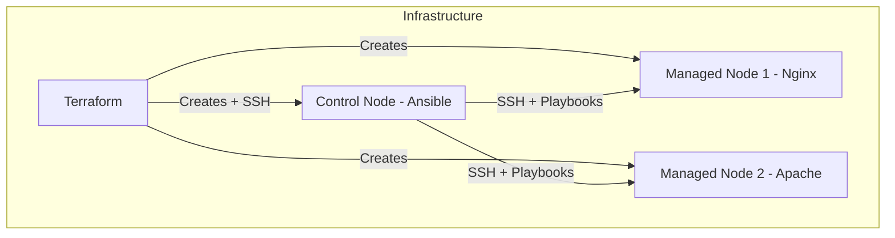

# Bootstrapping Ansible on latest Amazon Linux via Terraform

## Description

This project demonstrates how to bootstrap a functional Ansible setup on AWS with Terraform.

It provisions 3 nodes, 1 Ansible control node and 2 managed nodes, to showcase the infrastructure creation via Terraform and the config management via Ansible. Ansible will provision and deploy a sample web page on the 2 managed nodes using Apache and Nginx.

For easier demonstration, Terraform will SCP the Ansible configuration to the control node at runtime.

## Requirements/Dependencies:

To run this project, you will need:

- Terraform version >= 1.12
- Current latest provider versions of AWS, TLS, Local, and Null (automatically installed on `terraform init`)
- AWS CLI configured with valid credentials

## Instructions for Use

_Note: This project will create and utilize an ephemeral SSH key in your local directory. Please remember to `terraform destroy` your resources when finished_

Initialize and apply Terraform configuration

1. Clone the repository
2. Run a `terraform init` to initialize the working directory
3. Run a `terraform apply` to provision the infra
4. Watch Terraform and Ansible do their thing in the console
5. Visit the webserver addresses that are given in the terraform output. Enjoy :)
